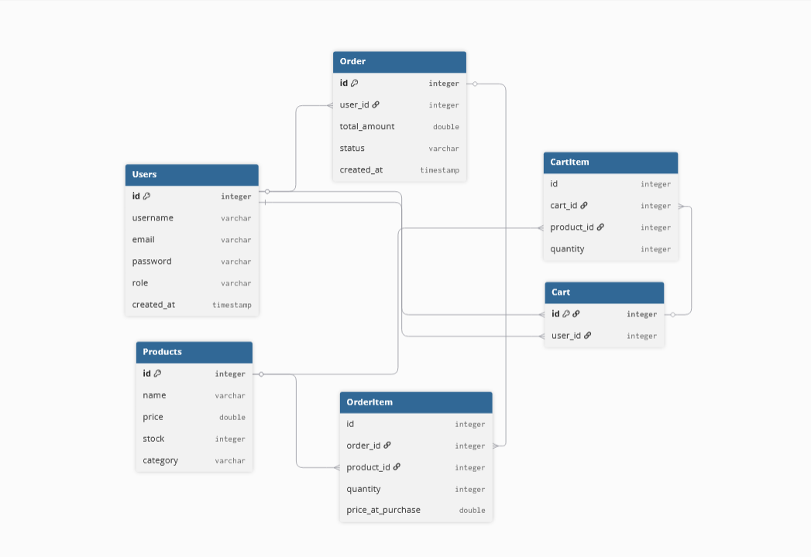

# E-Commerce Backend System

This is a backend application built using Spring Boot that provides RESTful APIs for managing products, cart, and order workflows. The system is designed to simulate real-world e-commerce functionality with user-specific operations and clean architecture.

## Tech Stack
- Java
- Spring Boot
- Spring Data JPA (Hibernate)
- MySQL
- REST APIs
- Postman (API Testing)

## Core Features
- User-specific Cart Management
- Add / Update / Remove items from cart
- Order Placement from Cart
- Total Price Calculation
- Data Persistence using JPA
- Layered Architecture (Controller-Service-Repository)

## Application Flow

1. User adds products to the cart  
2. Cart stores items specific to each user  
3. On placing an order:
   - Cart items are converted into order items  
   - Total price is calculated  
   - Order is saved in the database  
   - Cart is cleared  

## Architecture
The project follows a layered architecture:

- **Controller Layer** → Handles API requests  
- **Service Layer** → Business logic  
- **Repository Layer** → Database operations  

## ER-Diagram

## 1. Product APIs

|     #    |     API Name               |     Method    |     Endpoint                             |     Description                          |
|----------|----------------------------|---------------|------------------------------------------|------------------------------------------|
|     1    |     Add Product            |     POST      |     /api/products                        |     Create a new   product               |
|     2    |     Get All   Products     |     GET       |     /api/products                        |     Fetch all   products                 |
|     3    |     Get Product   By ID    |     GET       |     /api/products/{id}                   |     Fetch single   product by ID         |
|     4    |     Update   Product       |     PUT       |     /api/products/{id}                   |     Update   product details             |
|     5    |     Delete   Product       |     DELETE    |     /api/products/{id}                   |     Delete a   product                   |
|     6    |     Get By   Category      |     GET       |     /api/products/category/{category}    |     Fetch   products by category         |
|     7    |     Get By Name            |     GET       |     /api/products/name/{name}            |     Fetch product   by exact name        |
|     8    |     Search   Products      |     GET       |     /api/products/search?keyword=xyz     |     Search   products (partial match)    |

## 2. User APIs

|     #    |     API Name               |     Method    |     Endpoint                            |     Description                          |
|----------|----------------------------|---------------|-----------------------------------------|------------------------------------------|
|     1    |     Register User          |     POST      |     /api/users                          |     Create a new   user account          |
|     2    |     Get All Users          |     GET       |     /api/users                          |     Fetch all   users                    |
|     3    |     Get User By   ID       |     GET       |     /api/users/{id}                     |     Fetch single   user by ID            |
|     4    |     Update User            |     PUT       |     /api/users/{id}                     |     Update user   details                |
|     5    |     Delete User            |     DELETE    |     /api/users/{id}                     |     Delete a user                        |
|     6    |     Get User By   Email    |     GET       |     /api/users/email?email=xyz          |     Fetch user   using email             |
|     7    |     Login User             |     POST      |     /api/users/login                    |     Authenticate   user                  |
|     8    |     Search   Products      |     GET       |     /api/products/search?keyword=xyz    |     Search   products (partial match)    |

## 3. Cart APIs

|     #    |     API Name               |     Method    |     Endpoint                       |     Description                              |
|----------|----------------------------|---------------|------------------------------------|----------------------------------------------|
|     1    |     Add to Cart            |     POST      |     /api/cart                      |     Add a product   to user's cart           |
|     2    |     Get User Cart          |     GET       |     /api/cart/user/{userId}        |     Fetch all   cart items for a user        |
|     3    |     Update Cart   Item     |     PUT       |     /api/cart/{cartItemId}         |     Update   quantity of a cart item         |
|     4    |     Remove Cart   Item     |     DELETE    |     /api/cart/item/{cartItemId}    |     Remove a   specific item from cart       |
|     5    |     Clear Cart             |     DELETE    |     /api/cart/user/{userId}        |     Remove all   items from a user's cart    |
|     6    |     Get Cart Item By ID    |     GET       |     /api/cart/item/{cartItemId}    |     Fetch a   specific cart item             |
|     7    |     Login User             |     POST      |     /api/users/login               |     Authenticate   user                      |

## 4. Order APIs

|     #    |     API Name                 |     Method    |     Endpoint                        |     Description                           |
|----------|------------------------------|---------------|-------------------------------------|-------------------------------------------|
|     1    |     Place Order              |     POST      |     /api/orders/place               |     Convert cart   items into an order    |
|     2    |     Get User   Orders        |     GET       |     /api/orders/user/{userId}       |     Fetch all   orders of a user          |
|     3    |     Get Order By   ID        |     GET       |     /api/orders/{orderId}           |     Fetch a specific order                |
|     4    |     Cancel Order             |     DELETE    |     /api/orders/{orderId}           |     Cancel an existing order              |
|     5    |     Update Order   Status    |     PUT       |     /api/orders/{orderId}/status    |     Update order status                   |
|     6    |     Get All   Orders         |     GET       |     /api/orders                     |     Fetch all orders in system            |

